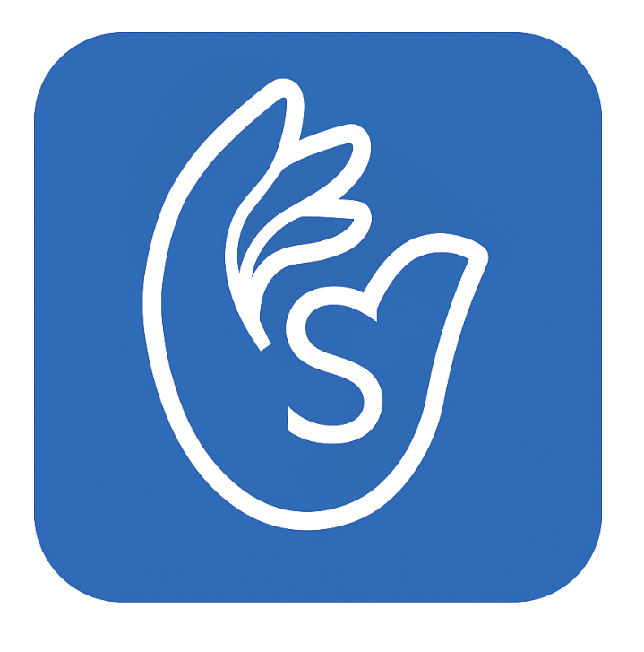
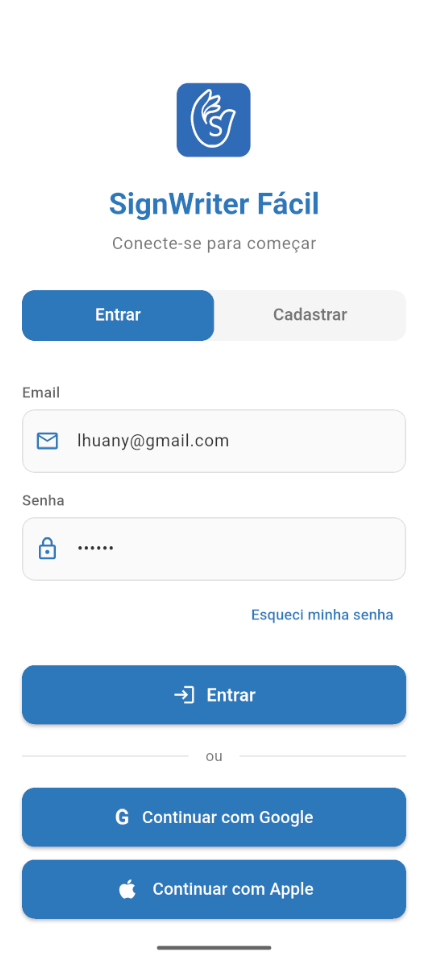
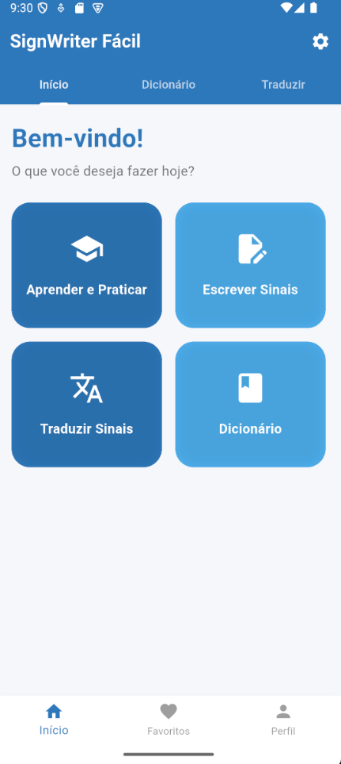
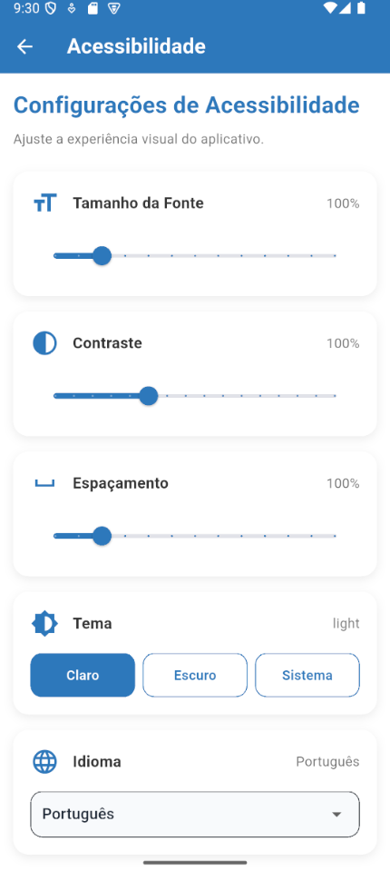
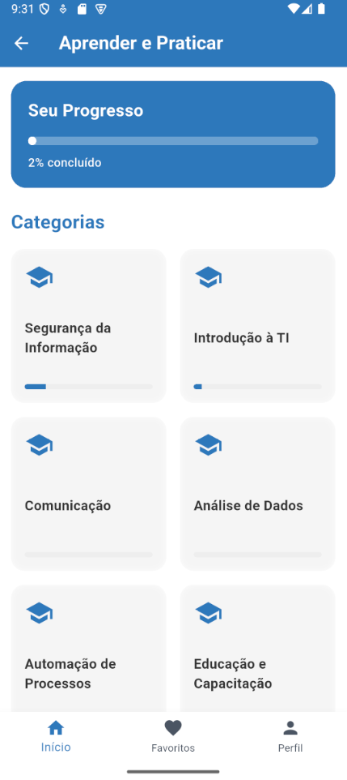
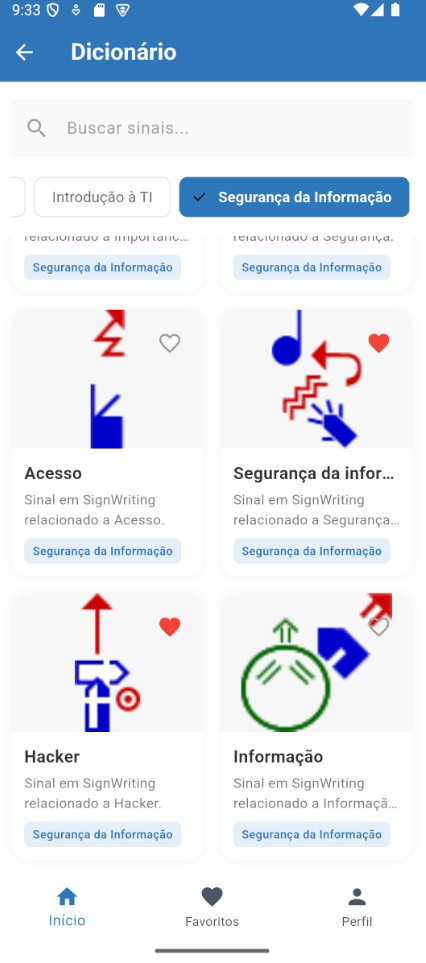
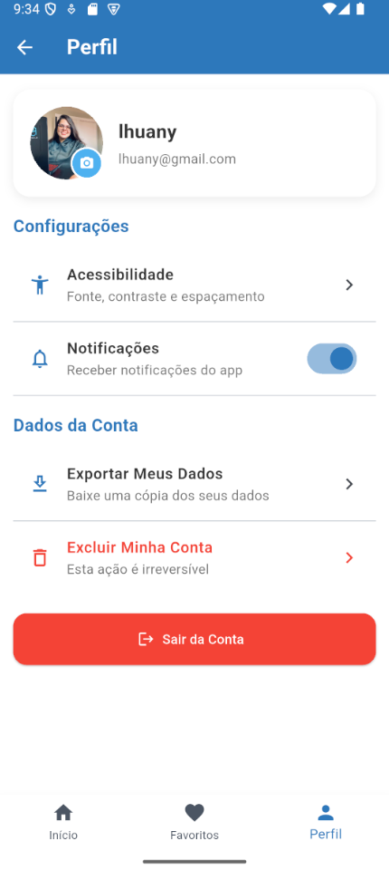

<div align="center">



# SignWriter Fácil

### 🌍 Tecnologia, Inclusão e Acessibilidade através do SignWriting

Aplicativo multiplataforma desenvolvido em Flutter com foco em aprendizado, comunicação visual e acessibilidade para usuários da língua de sinais.

[](https://flutter.dev)
[](https://dart.dev)
[](https://supabase.com)
[](https://pub.dev/packages/provider)
[](LICENSE)

</div>

---

# 📋 Índice

* [📖 Sobre o Projeto](#-sobre-o-projeto)
* [✨ Funcionalidades](#-funcionalidades)
* [♿ Sistema de Acessibilidade](#-sistema-de-acessibilidade)
* [📱 Capturas de Tela](#-capturas-de-tela)
* [🧠 Arquitetura](#-arquitetura)
* [🛠️ Tecnologias Utilizadas](#️-tecnologias-utilizadas)
* [📂 Estrutura do Projeto](#-estrutura-do-projeto)
* [🚀 Como Executar o Projeto](#-como-executar-o-projeto)
* [🌍 Roadmap](#-roadmap)
* [🤝 Contribuições](#-contribuições)
* [👨‍💻 Desenvolvedores](#-desenvolvedores)
* [📄 Licença](#-licença)

---

> ⚠️ Projeto educacional focado em inclusão, acessibilidade e comunicação através do sistema visual SignWriting.

---

# 📖 Sobre o Projeto

O **SignWriter Fácil** é um aplicativo desenvolvido para auxiliar no aprendizado e utilização do sistema **SignWriting**, uma escrita visual criada por **Valerie Sutton** para representação gráfica das línguas de sinais.

O projeto busca aproximar surdos e ouvintes através de uma experiência moderna, intuitiva e acessível.

---

# ✨ Funcionalidades

## 📘 Aprender e Praticar

Sistema interativo com categorias, progresso e exercícios.

---

## ✍️ Escrita de Sinais

Criação e edição de sinais utilizando o padrão visual SignWriting.

---

## 📚 Dicionário de Sinais

Pesquisa organizada de sinais por categorias.

---

## ❤️ Favoritos

Sistema de favoritos para salvar sinais importantes.

---

## 👤 Perfil do Usuário

Gerenciamento de conta e preferências do aplicativo.

---

## 🌙 Temas Dinâmicos

* Tema claro
* Tema escuro
* Seguir sistema

---

# ♿ Sistema de Acessibilidade

O aplicativo possui um sistema de acessibilidade integrado em toda a aplicação.

## Recursos disponíveis

* 🔠 Ajuste de fonte (80% – 150%)
* 📐 Controle de espaçamento
* 🎨 Ajuste de contraste
* 🌙 Tema escuro/claro
* 🌍 Suporte multilíngue
* 💾 Persistência automática das preferências

---

# 📱 Capturas de Tela

## 🔐 Tela de Login



---

## 🏠 Tela Inicial



---

## ♿ Tela de Acessibilidade



---

## 📘 Aprender e Praticar



---

## 📚 Dicionário



---

## 👤 Perfil



---

# 🧠 Arquitetura

O projeto utiliza a arquitetura **MVVM (Model-View-ViewModel)**.

| Camada | Responsabilidade |
|---|---|
| Model | Dados e entidades |
| View | Interface visual |
| ViewModel | Estados e lógica de apresentação |

---

# 🛠️ Tecnologias Utilizadas

| Tecnologia | Finalidade |
|---|---|
| Flutter | Desenvolvimento multiplataforma |
| Dart | Linguagem principal |
| Provider | Gerenciamento de estado |
| Supabase | Backend e autenticação |
| SharedPreferences | Persistência local |
| Material 3 | Design moderno |

---

# 📂 Estrutura do Projeto

```bash
lib/
├── models/
├── routes/
├── services
├── theme
├── viewmodels
├── views/
│   ├── screens/
│   └── widgets/
└── main.dart
```

---

# 🚀 Como Executar o Projeto

## 🔧 Pré-requisitos

* Flutter 3.x
* Dart SDK
* Android Studio ou VSCode
* Emulador Android/iOS

---

## 1️⃣ Clone o repositório

```bash
git clone https://github.com/LhuanyMotta/SignWriter-Easy-App
```

---

## 2️⃣ Entre na pasta do projeto

```bash
cd SignWriter-Easy-App
```

---

## 3️⃣ Instale as dependências

```bash
flutter pub get
```

---

## 4️⃣ Configure o arquivo .env

```env
SUPABASE_URL=SUA_URL
SUPABASE_KEY=SUA_CHAVE
```

---

## 5️⃣ Execute o aplicativo

```bash
flutter run
```

---

# 🌍 Roadmap

## 🔜 Próximas funcionalidades

- [ ] Tradução automática de sinais
- [ ] Reconhecimento de sinais via câmera
- [ ] Integração com IA
- [ ] Estatísticas de aprendizado
- [ ] Mais idiomas
- [ ] Sistema offline
- [ ] Gamificação

---

# 🤝 Contribuições

Contribuições são muito bem-vindas.

## Como contribuir

1. Faça um fork do projeto
2. Crie uma branch
3. Faça suas alterações
4. Envie um pull request

---

# 👨‍💻 Desenvolvedores

<div align="center">

| Desenvolvedor | GitHub |
|---|---|
| Bruno Santos | https://github.com/Br2n0 |
| Lhuany Motta | https://github.com/LhuanyMotta |

</div>

---

# 📄 Licença

Este projeto está sob a licença MIT.

---

<div align="center">

# 💙 SignWriter Fácil

### Inclusão, acessibilidade e tecnologia caminhando juntas.

</div>
